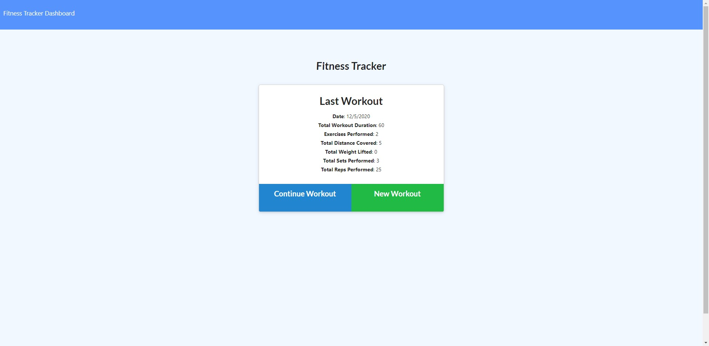

# Daily Workout Tracker

   



## Description
This is an app that uses mongoose npm package and mongo db to track daily workouts and the exercises performed during the workouts. This app is used to show an understanding of mongodb and a successful deployment of the app to Heroku using MongoDB Atlas.
## Table of Contents 
  - [Installation](#installation)
  - [Usage](#usage)
  - [Contributing](#contributing)
  - [Tests](#tests)
  - [Questions](#questions)
  - [License](#license)
## Installation
To install necessary dependencies, run the following command:
``` 
npm install
```
## Usage
This app is meant to be used to track workouts and the exercises performed during the workouts daily. It then saves that data to a MongoDB Atlas database where it shows the user the last workout, as well as charts and breakdowns of the workouts using charts.js.

To run the app localy, use command:
``` 
npm run start
```
## Contributing
N/A
## Tests
To run tests, run the following command:
```
N/A
```
## Questions
If you have any questions about the repo, open an issue or contact me directly at Skirkp18@gmail.com. You can find more of my work on [GitHub](https://github.com/Skirkp18).
## License
MIT License

Copyright (c) 2020 Skirkp18

Permission is hereby granted, free of charge, to any person obtaining a copy
of this software and associated documentation files (the "Software"), to deal
in the Software without restriction, including without limitation the rights
to use, copy, modify, merge, publish, distribute, sublicense, and/or sell
copies of the Software, and to permit persons to whom the Software is
furnished to do so, subject to the following conditions:

The above copyright notice and this permission notice shall be included in all
copies or substantial portions of the Software.

THE SOFTWARE IS PROVIDED "AS IS", WITHOUT WARRANTY OF ANY KIND, EXPRESS OR
IMPLIED, INCLUDING BUT NOT LIMITED TO THE WARRANTIES OF MERCHANTABILITY,
FITNESS FOR A PARTICULAR PURPOSE AND NONINFRINGEMENT. IN NO EVENT SHALL THE
AUTHORS OR COPYRIGHT HOLDERS BE LIABLE FOR ANY CLAIM, DAMAGES OR OTHER
LIABILITY, WHETHER IN AN ACTION OF CONTRACT, TORT OR OTHERWISE, ARISING FROM,
OUT OF OR IN CONNECTION WITH THE SOFTWARE OR THE USE OR OTHER DEALINGS IN THE
SOFTWARE.
